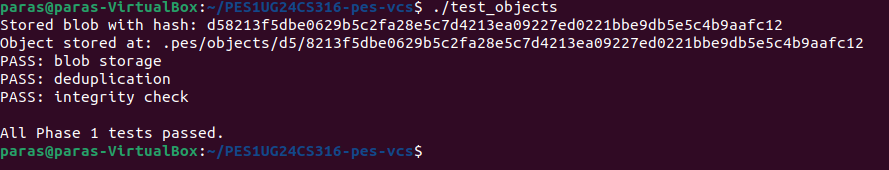
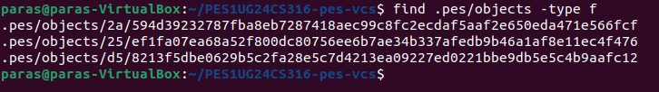
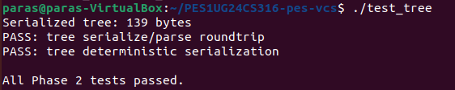
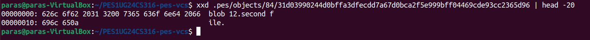
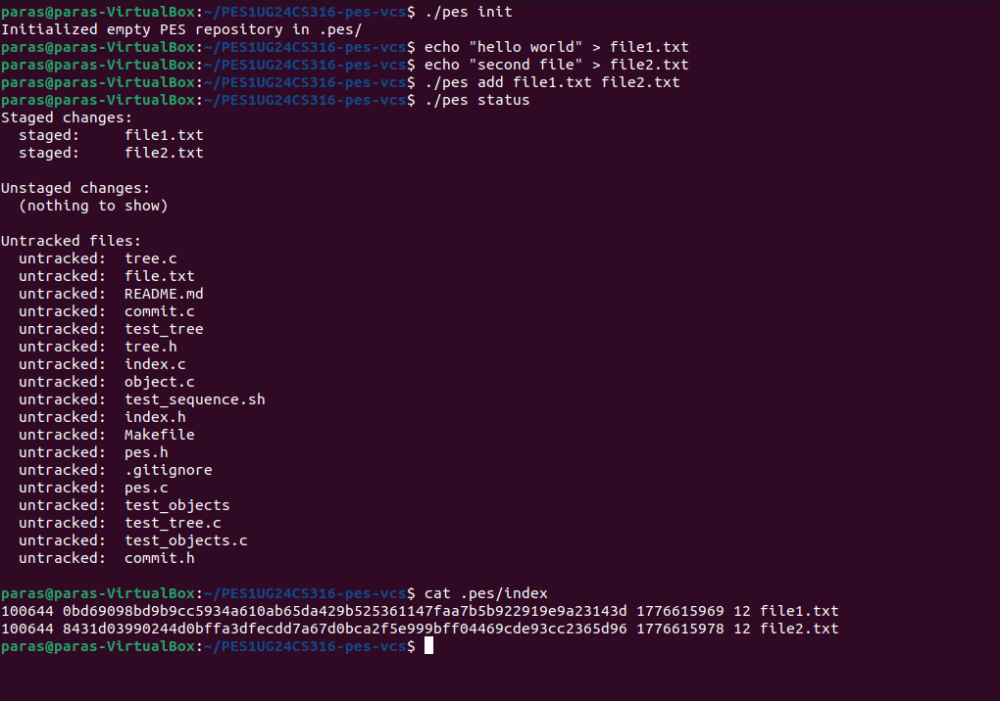
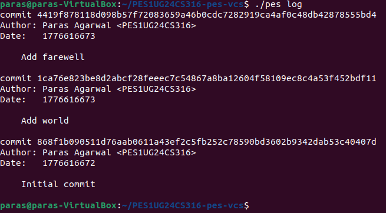
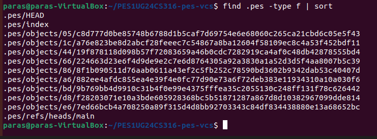
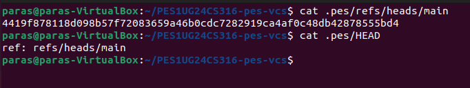
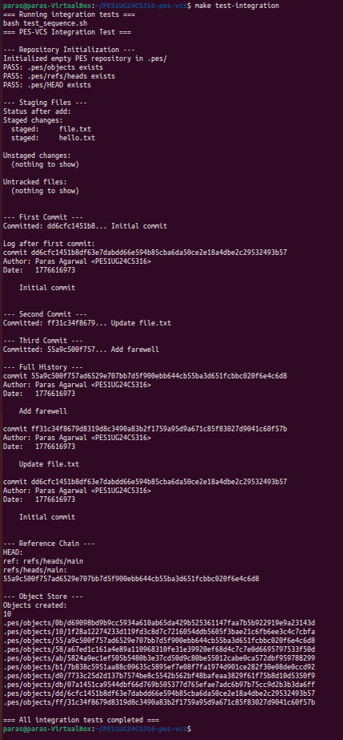

# OS ORANGE PROBLEM UNIT 4 LAB REPORT

**Name:** Paras Agarwal  
**SRN:** PES1UG24CS316  
**Repository:** PES1UG24CS316-pes-vcs  
**Platform:** Ubuntu 22.04

---

## Table of Contents

1. [Phase 1 — Object Storage](#phase-1--object-storage)
2. [Phase 2 — Tree Objects](#phase-2--tree-objects)
3. [Phase 3 — Staging Area (Index)](#phase-3--staging-area-index)
4. [Phase 4 — Commits and History](#phase-4--commits-and-history)
5. [Phase 5 — Branching and Checkout (Analysis)](#phase-5--branching-and-checkout-analysis)
6. [Phase 6 — Garbage Collection (Analysis)](#phase-6--garbage-collection-analysis)

---

## Phase 1 — Object Storage

### What I Implemented

**File:** `object.c`  
**Functions:** `object_write`, `object_read`

**`object_write`:**
1. Builds a header string in the format `"<type> <size>\0"` (e.g. `"blob 16\0"`)
2. Allocates a buffer combining header + raw data into one contiguous block
3. Computes SHA-256 hash of the full combined buffer using `compute_hash()`
4. Checks for deduplication using `object_exists()` — if the object already exists, sets `*id_out` and returns immediately without writing
5. Creates the shard directory `.pes/objects/XX/` where `XX` is the first 2 hex characters of the hash, using `mkdir()`
6. Writes to a temporary file inside the shard directory using `mkstemp()`
7. Calls `fsync()` to flush the temp file to disk
8. Atomically renames the temp file to the final object path using `rename()`
9. Calls `fsync()` on the shard directory file descriptor to persist the rename
10. Stores the computed hash in `*id_out` and returns 0

**`object_read`:**
1. Builds the file path from the hash using `object_path()`
2. Opens and reads the entire file into memory using `fopen()` and `fread()`
3. Recomputes the SHA-256 hash of the file contents using `compute_hash()` and compares against the expected hash using `memcmp()` — returns `-1` if they differ (corruption detected)
4. Finds the `\0` byte separating the header from the data using `memchr()`
5. Parses the type string (`"blob"`, `"tree"`, or `"commit"`) using `strncmp()` and sets `*type_out`
6. Copies the data portion (everything after the `\0`) into a newly allocated buffer
7. Sets `*data_out` and `*len_out`, frees the raw buffer, returns 0

### Screenshot 1A — `./test_objects` output



### Screenshot 1B — Sharded object directory structure



---

## Phase 2 — Tree Objects

### What I Implemented

**File:** `tree.c`  
**Function:** `tree_from_index` (with recursive helper `write_tree_level`)

`tree_parse`, `tree_serialize`, and `get_file_mode` were already provided. I only implemented `tree_from_index`.

**`write_tree_level` (recursive helper):**
- Takes a slice of index entries and a current depth level
- Iterates through entries — for each entry at this depth:
  - If the path component at this depth has no `/` after it, it is a plain file — adds it directly as a `TreeEntry` with the mode and hash from the index
  - If the path component has a `/` after it, the entry belongs to a subdirectory — finds all consecutive entries sharing that same directory prefix, recurses on that group at `depth + 1` to get the subtree's `ObjectID`, then adds a directory `TreeEntry` with mode `040000`
- After building the `Tree` struct for this level, calls `tree_serialize()` to convert it to binary, then `object_write(OBJ_TREE, ...)` to persist it to the object store
- Returns the resulting `ObjectID` in `*id_out`

**`tree_from_index`:**
- Calls `index_load()` to read all staged entries into an `Index` struct
- Returns `-1` if the index is empty (nothing staged)
- Calls `write_tree_level()` on all entries starting at depth 0 to recursively build the full tree hierarchy
- Returns the root tree's `ObjectID` in `*id_out`

### Screenshot 2A — `./test_tree` output



### Screenshot 2B — Raw binary tree object (`xxd`)



The `xxd` output shows the binary object format. The hex `626c 6f62 2031 32` decodes to ASCII `"blob 12"` — the object type header. After the null byte `00`, the raw file content follows (`"second f"` continuing as `"ile."` on the next line), confirming that the content-addressable storage format is working correctly with the header and data concatenated as expected.

---

## Phase 3 — Staging Area (Index)

### What I Implemented

**File:** `index.c`  
**Functions:** `index_load`, `index_save`, `index_add`

`index_find`, `index_remove`, and `index_status` were already provided.

**`index_load`:**
- Opens `.pes/index` with `fopen()` in read mode
- If the file does not exist, sets `index->count = 0` and returns 0 — this is not an error, it just means nothing has been staged yet
- Reads each line with `fscanf()` using the format `%o %64s %llu %u %511s` to parse: mode, hex hash, mtime (seconds), size (bytes), and path
- Calls `hex_to_hash()` to convert the 64-character hex string into an `ObjectID`
- Increments `index->count` for each successfully parsed entry, closes the file, returns 0

**`index_save`:**
- Makes a local sorted copy of the index using `qsort()` with a `strcmp`-based comparator on the `path` field
- Opens `.pes/index.tmp` for writing with `fopen()`
- Writes each entry as a single line: `<mode-octal> <64-hex-hash> <mtime> <size> <path>\n`, using `hash_to_hex()` to convert the `ObjectID`
- Calls `fflush()`, then `fsync(fileno())` to ensure data reaches disk before the rename
- Closes the file, then atomically replaces the real index with `rename(".pes/index.tmp", INDEX_FILE)`

**`index_add`:**
- Opens and reads the full contents of the target file using `fopen()` and `fread()`
- Calls `object_write(OBJ_BLOB, data, len, &id)` to store the file contents as a blob object
- Calls `lstat()` to get the file's current mode, modification time, and size
- Uses `index_find()` to check if an entry already exists for this path — updates it in place if yes, appends a new entry if no
- Fills in `hash`, `mode`, `mtime_sec`, `size`, and `path` on the entry
- Calls `index_save()` to atomically persist the updated index

### Screenshot 3B — `cat .pes/index` showing text-format index



Each line in the index file contains the mode, SHA-256 hash (hex), mtime (unix timestamp), file size in bytes, and the file path:

```
100644 0bd69098bd9b9cc5934a610ab65da429b525361147faa7b5b922919e9a23143d 1776615969 12 file1.txt
100644 8431d03990244d0bffa3dfecdd7a67d0bca2f5e999bff04469cde93cc2365d96 1776615978 12 file2.txt
```

---

## Phase 4 — Commits and History

### What I Implemented

**File:** `commit.c`  
**Function:** `commit_create`

`commit_parse`, `commit_serialize`, `commit_walk`, `head_read`, and `head_update` were all already provided. I only implemented `commit_create`.

**`commit_create`:**
1. Calls `tree_from_index(&tree_id)` to build the tree object from the current staged index — this is the snapshot of the project at commit time
2. Zero-initialises a `Commit` struct with `memset()`
3. Sets `c.tree = tree_id`
4. Attempts `head_read(&c.parent)` — if it succeeds, sets `c.has_parent = 1`; if it fails (no commits yet), sets `c.has_parent = 0`
5. Copies the author string from `pes_author()` which reads the `PES_AUTHOR` environment variable
6. Sets `c.timestamp = (uint64_t)time(NULL)` to record the current unix timestamp
7. Copies the commit message string into `c.message`
8. Calls `commit_serialize(&c, &data, &len)` to produce the text-format commit object
9. Calls `object_write(OBJ_COMMIT, data, len, commit_id_out)` to store it in the object store
10. Calls `head_update(commit_id_out)` to atomically update the current branch pointer to the new commit
11. Frees the serialized data buffer and returns 0

### Screenshot 4A — `./pes log` with three commits



### Screenshot 4B — `find .pes -type f | sort` showing object store growth



### Screenshot 4C — Reference chain (`cat .pes/refs/heads/main` and `cat .pes/HEAD`)



### Final — Full integration test (`make test-integration`)



---

## Phase 5 — Branching and Checkout (Analysis)

### Q5.1 — How would you implement `pes checkout <branch>`?

A branch in PES-VCS is simply a file at `.pes/refs/heads/<branch>` containing a commit hash. To implement `pes checkout <branch>`:

**Files that need to change in `.pes/`:**
- `.pes/HEAD` must be updated to `ref: refs/heads/<branch>` to point to the new branch

**What must happen to the working directory:**
1. Read the target branch file to get the target commit hash
2. Use `commit_parse()` to read the tree hash from that commit object
3. Recursively walk the target tree using `tree_parse()` — for every blob entry, call `object_read()` and write the contents to the working directory at the correct path, creating subdirectories as needed
4. Delete any files that were tracked in the previous branch's tree but are absent from the target branch's tree

**What makes this complex:**
- Files that exist in the current working directory but not in the target tree must be identified and deleted — this requires comparing two full tree hierarchies
- Nested subdirectories must be created or removed recursively, not just flat files
- File permissions must be restored correctly (`100755` vs `100644`)
- If any tracked file has local modifications that differ between branches, checkout must refuse to overwrite it — requiring conflict detection before any files are changed, to avoid silently discarding the user's work

---

### Q5.2 — How would you detect a "dirty working directory" conflict?

Using only the index and the object store, conflicts can be detected as follows:

1. For each file tracked in the current index, compare the stored `mtime_sec` and `size` fields against the current file's metadata obtained via `lstat()`
2. If either `mtime` or `size` differs, the file has been modified since it was last staged — this is an unstaged local modification
3. For each such modified file, look up what blob hash the target branch's tree has for that same path
4. If the target branch has a different blob hash for that path than the current index entry, then:
   - The file has local uncommitted changes
   - The two branches have different content for that file
   - Checking out would silently discard the user's work — so checkout must refuse

This approach mirrors Git's fast-path metadata check: `mtime + size` is used as a cheap proxy for "did the file change" without re-hashing every file, only raising a conflict when metadata indicates a genuine difference between local state and the target branch.

---

### Q5.3 — What happens in "Detached HEAD" state?

In detached HEAD state, `.pes/HEAD` contains a raw commit hash directly instead of `ref: refs/heads/<branch>`. When `pes commit` runs in this state:

- `head_read()` reads the commit hash directly from `HEAD`
- `commit_create()` uses it as the parent commit and creates the new commit object normally
- `head_update()` writes the new commit hash directly back into `HEAD` itself — no branch file is updated

This means new commits are created and stored successfully, and are reachable from `HEAD` — but the moment the user switches to any other branch, `HEAD` is overwritten and those commits become unreachable from any named reference.

**Recovery:** The commits are not immediately deleted — the objects still exist on disk in `.pes/objects/`. A user can recover them by:
1. Having noted the commit hash before switching (visible in `./pes log` while still in detached state)
2. Creating a new branch pointing to that hash: `echo <hash> > .pes/refs/heads/recovery-branch`
3. Switching to that branch: `pes checkout recovery-branch`

Without the hash, recovery requires scanning all objects in `.pes/objects/` and finding commit objects not reachable from any branch — essentially a manual garbage collection traversal in reverse.

---

## Phase 6 — Garbage Collection (Analysis)

### Q6.1 — Algorithm to find and delete unreachable objects

**Algorithm — Mark and Sweep:**

**Mark phase:**
1. Initialise an empty hash set to track all reachable `ObjectID` values
2. Read every file in `.pes/refs/heads/` — each contains a branch tip commit hash
3. For each branch tip, perform a full graph traversal:
   - Parse the commit object — add its hash to the reachable set
   - Follow the `tree` pointer — parse the tree, add its hash, then recursively add every blob and subtree hash in the tree hierarchy
   - Follow the `parent` pointer to the previous commit and repeat until reaching a root commit with no parent
4. Use the hash set to skip already-visited objects and avoid redundant work on shared history

**Sweep phase:**
1. Walk every file under `.pes/objects/XX/YYY...`
2. Reconstruct the full `ObjectID` from the directory name and filename
3. If the hash is not present in the reachable set, delete the file with `unlink()`
4. After deleting files, remove any now-empty shard directories with `rmdir()`

**Data structure:** A hash set of `ObjectID` (32-byte SHA-256 hashes) provides O(1) average-case lookup. In C, a sorted array of hashes with binary search also works and avoids dynamic allocation complexity — O(log N) per lookup, still very fast in practice.

**Estimate for 100,000 commits and 50 branches:**
- Each commit references 1 tree; each tree references approximately 10–50 blobs and subtrees on average
- Total objects to visit in the mark phase ≈ 100,000 commits + 100,000 trees + ~1,500,000 blobs ≈ 1.6 million objects
- With a hash set, this is O(N) total — feasible in seconds on modern hardware

---

### Q6.2 — Race condition between GC and concurrent commit

**The race condition:**

Consider this interleaving of GC and a concurrent `pes commit`:

1. GC starts its mark phase and scans all reachable objects, building the reachable set based on the current branch tips
2. A concurrent `pes commit` begins — it calls `tree_from_index()` which calls `object_write()` repeatedly to store new blob and tree objects into `.pes/objects/`. These objects now exist on disk but are not yet referenced by any commit or branch pointer
3. GC finishes its mark phase — the new blobs and trees were written after the scan completed, so they are **not** in the reachable set
4. GC's sweep phase deletes those new blobs and trees, treating them as unreachable garbage
5. `pes commit` continues — it calls `object_write(OBJ_COMMIT, ...)` to write the commit, then `head_update()` to update the branch pointer
6. The commit is now stored and HEAD points to it — but the tree and blob objects it references have already been deleted
7. The repository is now corrupt: the commit points to objects that no longer exist on disk

**How Git avoids this:**

Git uses a **grace period** (configured by `gc.pruneExpire`, default 2 weeks): the sweep phase only deletes objects whose filesystem `mtime` is older than the grace period. Any object written recently — including in-progress commit intermediates — is kept regardless of reachability. This ensures a concurrent commit's blobs and trees, which were just written to disk, are always within the grace period and will never be swept.

In PES-VCS, a safe approach would be to only delete objects whose file `mtime` is older than a safe threshold (e.g. 60 seconds), giving any in-progress `pes commit` enough time to complete and update HEAD before its intermediate objects become eligible for deletion.
